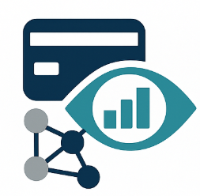

<!--

<!-- PROJECT LOGO -->
 

  

<h3 align="center">Scoring Project</h3>

  

    Scoring credit
     
    <a href="https://github.com/fruitsamurai97/Scoring-API-with-Explainability-and-LLM-Reporting"><strong>Explore the docs »</strong></a>
     
     
    .
    <a href="https://fruit-scoring.azurewebsites.net/">View Demo</a>
    .
  

<!-- ABOUT THE PROJECT -->
## About The Project

[![Product Name Screen Shot][product-screenshot]](https://fruit-scoring.azurewebsites.net/)

# Credit Decision Analysis Project

## Overview
This project utilizes a dataset from Kaggle, designed to model and analyze credit loan decisions for individuals. The dataset comprises a main table split into two files: one for training data (including a TARGET column indicating loan repayment outcomes) and one for testing data (without the TARGET column). Through the application developed in Streamlit, users can assess the creditworthiness of potential clients by leveraging a machine learning model trained on the dataset.

## Dataset
The dataset originates from Kaggle, containing static data for various loan applications. Each row represents a single loan application by a client. The dataset is divided into:
- **Training data**: Includes the `TARGET` column, which signifies whether the loan was repaid.
- **Testing data**: Lacks the `TARGET` column, used for model predictions.

## Notebooks
The transformation of datasets and model training is performed in Jupyter notebooks, located in the `notebooks` folder. The output includes:
- The testing dataset ready for prediction.
- A LightGBM model trained on the training data. This model uses a custom metric to penalize false negatives significantly, addressing the risk of predicting a client as creditworthy when they are not.
- An explanation module using the LIME library, providing insights into the model's decision-making process.

## Application
The application is developed with Streamlit and requires Python 3.11 or higher. It enables users to:
1. **Select a Client ID**: Choose from the test dataset.
2. **View Client Overview**: Display an overview, including the probability of default, probability of payback, and the model's loan decision.
3. **Model Decision Explanation**: By clicking on "show explanations," users can see the top 5 features influencing the model's decision through the LIME explainer. This includes positive or negative contributions, feature distributions, the specific client's feature values, and LIME thresholds for decision-making.

## Getting Started

### Prerequisites
Ensure you have Python 3.11 or higher installed on your machine.

### Installation
1. Clone the repository to your local machine.
2. Navigate to the project directory and install required dependencies:  
  *  pip install -r requirements.txt
3. Run the Streamlit application:
  * streamlit run app.py

[product-screenshot]: images/screenshot.png
